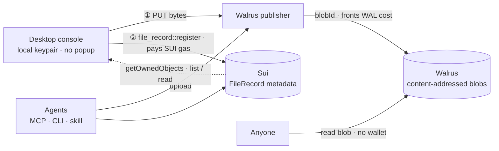

# WalDrive

> The file-management + verifiable-data console for the data your AI agents store and remember on **Walrus**, built for the **Sui Overflow 2026 Walrus track** (idea #032). The pitch is frontend fluidity over verifiable agent data.
>
> Everyone else in the track ships a protocol or an SDK — WalDrive is the **human interface layer**: the screen you operate agent data from. Every feature in the demo is live on testnet, no mock.

**Live site:** [waldrive.flacier.com](https://waldrive.flacier.com/) · **Install the agent skill:** `npx skills add Fldicoahkiin/WalDrive`

WalDrive is a **cross-platform desktop app** — a Tauri 2.0 shell wrapping a Vite + React SPA. File **metadata lives on Sui** (Move objects), **blob bytes live on Walrus**, and there is **no backend in between** — "verifiable data" means on-chain Sui metadata over content-addressed Walrus blobs. The app signs Sui transactions in-process with a local keypair (no browser, no wallet extension); the **MCP server is the agent write-path**, so AI clients / CLIs write artifacts and memory to the same Walrus data you browse here.

- **Desktop console** — the human surface for agent data on Walrus: drag-to-upload, browse, preview, rename, tag, version, organise into folders, trash / restore, search, and share; a multi-account local wallet (generate / import / switch / balance / faucet) and endpoints from the sidebar.
- **Agent surfaces** — three ways for an agent to reach the same Walrus data:
  - **MCP server** — `upload_file` / `list_files` / `download_file` / `get_file_info` for AI clients.
  - **`waldrive` CLI** — `upload` / `ls` / `download` / `info` for shells, scripts, and CI.
  - **Agent skill** — `npx skills add Fldicoahkiin/WalDrive` teaches any AI agent to store, retrieve, and verify its data on Walrus.
- **Move contracts** — `FileRecord` and `ShareLink` objects make file metadata verifiable on-chain.

---

## How it works



> Two-step write: bytes go to the Walrus publisher (which fronts the WAL storage cost and returns a content-addressed `blobId`), then one in-process Sui transaction records a `FileRecord` (you pay only SUI gas). Reads hit the public aggregator — no wallet. No backend in between.

**Upload is publisher-direct** — a local process has no CORS limits, so the app PUTs straight to the public Walrus testnet publisher; no proxy / backend. The publisher fronts the WAL storage cost and (via `send_object_to`) hands the on-chain Blob object to your local wallet, so you can renew or delete it. You pay only SUI gas for the one `register` transaction.

**Sharing is self-contained** — the desktop app has no web share page, so "Share link" copies the public aggregator URL (`/v1/blobs/{blobId}`) to the clipboard; anyone can open it, no wallet. (`share_link.move` is kept on-chain for a future web share surface — Roadmap.)

---

## Tech stack

| Layer | Choice |
|---|---|
| Desktop shell | Tauri 2.0 (Rust, `src-tauri/`) — single transparent overlay window |
| Frontend | Vite 6 + React 19, TypeScript strict (single-window SPA) |
| UI | HeroUI v3 (`@heroui/react` + `@heroui/styles`), Tailwind v4, `motion` (framer-motion) |
| Sui | `@mysten/sui` — in-process Ed25519 keypair (no wallet extension) |
| Data/cache | TanStack React Query v5 · Zustand |
| Storage | Walrus (publisher PUT, aggregator GET) |
| Contracts | Move (Sui), deployed on testnet |
| MCP | `@modelcontextprotocol/sdk`, `zod` |
| Package manager | **bun** (only) |

---

## Getting started

### Prerequisites
- [bun](https://bun.sh)
- [Rust](https://rustup.rs) + the [Tauri 2.0 system dependencies](https://tauri.app/start/prerequisites/) for your OS
- [Sui CLI](https://docs.sui.io) with a testnet address and some gas (`sui client faucet`)

### Install
```bash
bun install
```

### Deploy the contracts (or reuse the existing testnet deployment)
```bash
sui move build  --path contracts
sui client publish --gas-budget 200000000 contracts
# copy the PackageID into .env.local as VITE_CONTRACT_PACKAGE_ID
```
A testnet deployment already exists:
```
PACKAGE_ID = 0xf7ac2790c5fe604fdd4b7666605a7e7423cf2feb43e37564b6158d9db800ad45
```

### Configure env
```bash
cp .env.local.example .env.local
# then set VITE_CONTRACT_PACKAGE_ID to your PackageID and
# VITE_WALDRIVE_KEYPAIR to a dedicated testnet keypair (suiprivkey1…)
```
```bash
# .env.local — Vite reads import.meta.env.VITE_*
VITE_CONTRACT_PACKAGE_ID=0x2fc3…b5f6
VITE_WALRUS_AGGREGATOR=https://aggregator.walrus-testnet.walrus.space
VITE_WALRUS_PUBLISHER=https://publisher.walrus-testnet.walrus.space
VITE_SUI_NETWORK=testnet
VITE_WALDRIVE_KEYPAIR=suiprivkey1…   # optional — seeds the wallet on first run
```

> These are just **defaults** — network, Walrus endpoints, epochs and the contract package are all editable at runtime in **Settings** (left sidebar). `VITE_WALDRIVE_KEYPAIR` only *seeds* the wallet on first run: leave it empty and the app opens an onboarding screen to **generate or import** a wallet, after which the active key lives in `localStorage`.

### Run
```bash
bun tauri dev    # launches the desktop window (also starts Vite)
# or: bun dev    # browser preview at http://localhost:5173
```
Drag a file onto the drive to upload it — the local keypair signs in-process, no popup.

---

## MCP server

Lets AI clients (Claude, Cursor, …) and scripts operate the same Walrus data from the command line. It signs with a **dedicated testnet keypair** (`WALDRIVE_KEYPAIR`) — never your main Sui keystore. Generate one with `sui client new-address ed25519`, fund it via faucet, and export its `suiprivkey1…` string. See `mcp-server/.env.example`.

| Tool | Description |
|---|---|
| `upload_file` | Upload a local file to Walrus and register its metadata on Sui |
| `list_files` | List FileRecord objects owned by the configured keypair |
| `download_file` | Download a blob from Walrus by blob ID to a local path |
| `get_file_info` | Get a file's on-chain metadata + public read URL by object ID |

Client config (e.g. `~/.claude/claude_desktop_config.json`):
```json
{
  "mcpServers": {
    "waldrive": {
      "command": "bun",
      "args": ["/abs/path/to/waldrive/mcp-server/src/index.ts"],
      "env": {
        "SUI_NETWORK": "testnet",
        "CONTRACT_PACKAGE_ID": "0x2fc3…b5f6",
        "WALRUS_AGGREGATOR": "https://aggregator.walrus-testnet.walrus.space",
        "WALRUS_PUBLISHER": "https://publisher.walrus-testnet.walrus.space",
        "WALDRIVE_KEYPAIR": "suiprivkey1…"
      }
    }
  }
}
```

---

## CLI

`waldrive` drives the same upload + on-chain register from a shell — for scripts, CI, or an agent without an MCP client. Reads are wallet-free; only `upload` needs `WALDRIVE_KEYPAIR`. It reads the same env vars as the MCP server (`CONTRACT_PACKAGE_ID`, `SUI_NETWORK`, `WALRUS_*`, `WALDRIVE_KEYPAIR`).

```bash
# from a WalDrive checkout
bun run waldrive upload ./report.pdf
bun run waldrive ls --json
bun run waldrive download <blobId> --out ./out.pdf
bun run waldrive info <objectId>
```

| Command | Description |
|---|---|
| `upload <path>` | Upload to Walrus + register a FileRecord on Sui (`--name`, `--epochs`, `--json`) |
| `ls` | List files owned by the wallet (`--owner`, `--folder`, `--limit`, `--json`) |
| `download <blobId>` | Download a blob to a local path (`--out`) |
| `info <objectId>` | On-chain metadata + public read URL (`--json`) |

---

## Agent skill

`skills/waldrive/SKILL.md` teaches any AI agent to use WalDrive's MCP server or CLI to persist, retrieve, and **verify** its own data — artifacts, run outputs, cross-session memory — on Walrus. Install it into an agent's skill directory:

```bash
npx skills add Fldicoahkiin/WalDrive
```

The skill frames "verifiable data" as a concrete action: content-addressed Walrus blobs (tamper-evident) plus an on-chain Sui `FileRecord` (auditable provenance), with reads that need no wallet.

---

## Business model

Today everything runs on **testnet** and is free: the public Walrus publisher fronts WAL storage and you pay only SUI gas for the one `register` transaction (from a faucet). The model that turns this into a business shows up on mainnet — and it's built so the data agents produce pays its own way, and can even earn:

- **Pay per upload (metered).** Each write costs WAL storage + SUI gas on a public ledger. WalDrive fronts the publisher; the on-chain `FileRecord` is the receipt. An operator can cap or bill an agent's storage just by reading its FileRecords — no backend accounting needed.
- **Persistence & privacy (subscription).** Agent data has to outlive the run. A paid tier **auto-renews** Walrus blobs before they expire (today a blob is dropped while the FileRecord lingers — see Roadmap) and unlocks **private, encrypted (Seal)** storage for sensitive data.
- **Monetize your data (marketplace).** A share link can carry an on-chain paywall: other agents or humans pay to read your dataset/artifact, and WalDrive takes a small cut. Your agent's output becomes a tradable asset, not just a cost.

The write-path uses a **dedicated, low-value keypair**, so an agent pays for storage without ever holding keys to real assets. The mainnet upload path (user-signed, self-paid WAL via the Walrus SDK), auto-renewal, encryption, and the paywall are on the Roadmap — the desktop MVP proves the storage + verifiable-metadata core they all build on.

---

## Project structure

```
waldrive/
├── src-tauri/         # Tauri 2.0 desktop shell (Rust): main.rs, lib.rs, tauri.conf.json
├── packages/shared/   # runtime-agnostic: constants, types, Sui/Walrus helpers
├── contracts/         # Move: file_record, folder, share_link
├── src/               # Vite/React console (main.tsx, App.tsx, components, hooks, stores, lib)
├── mcp-server/        # MCP server (upload_file, list_files, download_file, get_file_info)
├── cli/               # waldrive CLI (upload, ls, download, info)
└── skills/waldrive/   # installable agent skill (SKILL.md)
```

## Scripts
```bash
bun dev            # Vite dev server (browser preview :5173)
bun tauri dev      # launch the desktop window
bun build          # Vite production build → dist/
bun tauri build    # bundle the desktop app (.app / .dmg / .exe …)
bun typecheck      # tsc --noEmit
sui move build --path contracts   # build contracts
```

---

## Roadmap

Deferred past the hackathon MVP (kept by design). Shipped since the original cut: multi-account wallet, trash, tags, versioning, nested folders + breadcrumb, sort + type filter, the mainnet publisher-auth header, and the `download_file` / `get_file_info` MCP tools.

- SDK `writeFilesFlow` upload (user-paid WAL, fully on-chain) for mainnet
- Blob renewal before expiry; mainnet end-to-end test
- Virtual scrolling; share-link expiry / `is_public` toggle
- Web share surface + short share codes (`share_link.move` exists but the desktop copies the aggregator URL)
- Secure keypair storage (OS keychain via a Tauri command — the key is currently in `localStorage`, seeded from `VITE_WALDRIVE_KEYPAIR`)
- More MCP tools: `create_folder`, `list_folders`, `create_share_link`

## Notes
- **Testnet only.** Mainnet needs new contract/Walrus URLs and a different upload path (mainnet publishers require auth).
- Aggregator read path is `/v1/blobs/{blobId}`.
- The publisher fronts WAL (storage); you still pay SUI gas for `register`.
- Walrus erasure-codes to a ~66 MB minimum billed size, so tiny files cost about the same.
- The app signs in-process with a **local Ed25519 keypair** you generate or import in-app (seeded from `VITE_WALDRIVE_KEYPAIR` on first run, then kept in `localStorage`) — no browser wallet, no popup. Use a **dedicated testnet keypair**, never one holding real assets.
- Move objects are the source of truth; the UI reconciles against chain on load.
